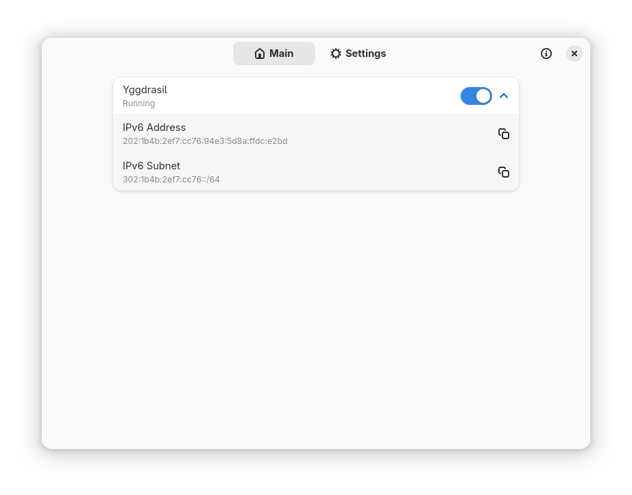
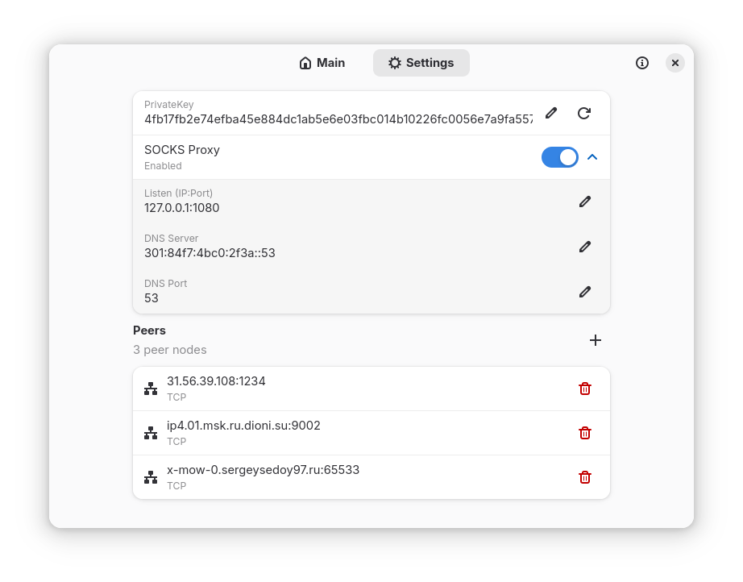

# yggdrasil-py-gtk
A modern GTK 4 + libadwaita desktop interface for running, configuring and monitoring a local [Yggdrasil](https://github.com/yggdrasil-network/yggdrasil-go) overlay-network node on Linux.

## Quick start

### Flatpak

```bash
flatpak remote-add --user yggdrasil-py-gtk https://grisha765.github.io/yggdrasil-py-gtk/grisha765.flatpakrepo
flatpak install --user yggdrasil-py-gtk io.github.grisha765.yggdrasil-py-gtk
````

### AppImage

Download the latest AppImage from the [releases page](https://github.com/grisha765/yggdrasil-py-gtk/releases) and make it executable:

```bash
chmod +x Yggdrasil-GTK-*.AppImage 
./Yggdrasil-GTK-*.AppImage
```

### Python package

```bash
pip install --upgrade git+https://github.com/grisha765/yggdrasil-py-gtk.git@main#egg=yggdrasil-py-gtk
python -m yggui
```

> **Want to build and run from source?**
> See the [developer deployment guide](.github/docs/development.md).

## Screenshots

| Main page                                             | Settings                                                 |
|-------------------------------------------------------|----------------------------------------------------------|
|         |  |

## Features

- One-click switch toggle Yggdrasil daemon or Yggstack SOCKS proxy
- Live status panel showing IPv6 address and /64 subnet
- Peer management with validation and persistence
- Optional SOCKS5 proxy & DNS forwarder via Yggstack
- Private-key viewer / editor / generator
- Clipboard helpers for address & subnet
- Flatpak-aware: automatically moves required binaries into the sandbox
- Graceful shutdown on exit or SIGINT

## License

This program is free software: you can redistribute it and/or modify  
it under the terms of the **GNU General Public License, version 3 or (at your option) any later version** published by the Free Software Foundation.

Copyright © 2025 Grisha

See the full license text in the [LICENSE](LICENSE) file or online at <https://www.gnu.org/licenses/gpl-3.0.txt>.
